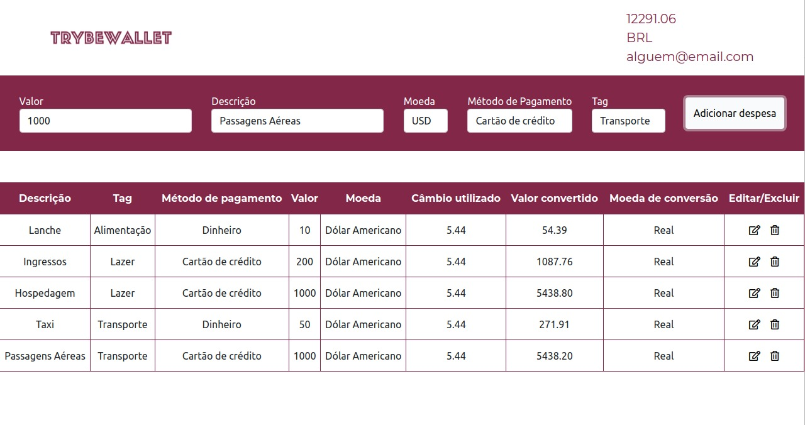

# Trybe-Project-Trybewallet

Desenvolvido utilizando _React_ e _Redux_ como ferramenta de manipulação de estado, além do consumo da API de Cotações de Moedas. 
Para estilização, utilizei o Bootstrap.

A aplicação é uma carteira digital de controle de gastos com um conversor do câmbio. Ao utilizá-la, o usuário será capaz de:

- Realizar login na aplicação;
- Adicionar, remover e editar um gasto;
- Visualizar uma tabela com seus gastos;
- Visualizar o total de gastos convertidos para uma moeda de escolha.

## Aplicação

## Instalando as dependências
`npm install`

## Inicializando a aplicação
`npm start`
